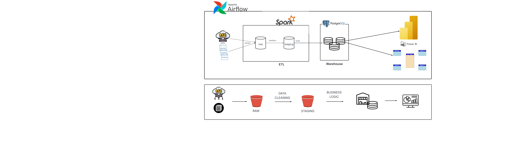

🚀 Crypto Data Warehouse Pipeline
📌 Project Overview

This project builds an end-to-end Data Engineering pipeline to collect, process, and analyze cryptocurrency market and news data.

The system extracts data from external APIs, processes it using Apache Spark, and loads analytical data into a PostgreSQL Data Warehouse following a Star Schema design.

The architecture follows modern Medallion Architecture:

Raw → Staging → Curated → Data Warehouse (Dim / Fact)

🧱 Data Pipeline Layers
1️⃣ Raw Layer

Stores original API data

Format: JSON / JSONL

Immutable storage

No transformation applied

Example:

data/raw/market/
data/raw/news/
2️⃣ Staging Layer

Initial data cleaning and schema normalization.

Processes:

Parse JSON

Data type casting

Remove null values

Standardize column names

Output format:

Parquet
3️⃣ Curated Layer

Business-ready datasets.

Processes:

Aggregation

Data enrichment

Metric calculation

Dataset joining

Example:

Daily crypto price metrics

News count per coin/day

4️⃣ Data Warehouse Layer

Implemented using Star Schema.

Dimension Tables

dim_coin

dim_date

dim_source

dim_author

Fact Tables

fact_market

fact_news

Schema:

warehouse_coin
🗄️ Data Warehouse Model
dim_coin ─────┐
              ├── fact_market ─── dim_date
              
dim_coin ─────┐
dim_source ───┼── fact_news ─── dim_author
              │
              └── dim_date
🐳 Running with Docker

Start services:

docker compose up -d

Check containers:

docker ps
▶️ Run Pipeline Manually
Step 1 — Crawl Data
python crawl/crawl_market.py
python crawl/crawl_news.py
Step 2 — Transform Raw → Staging
spark-submit spark_jobs/transform_raw.py
Step 3 — Build Curated Data
spark-submit spark_jobs/build_dim.py
spark-submit spark_jobs/build_fact.py
Step 4 — Load Data Warehouse
spark-submit spark_jobs/load_dw.py
🔌 PostgreSQL Connection
Database : warehouse
Schema   : warehouse_coin
User     : dw
Password : dw
Port     : 5432
✅ Features

Distributed processing with Spark

Incremental ETL support

Star Schema modeling

Dockerized environment

Scalable architecture

Ready for Airflow orchestration

🚧 Future Improvements

Airflow DAG orchestration

Incremental CDC loading

Data Quality validation

Dashboard visualization (Power BI / Superset)

Streaming ingestion

👨‍💻 Author

Huu Tam Nguyen
Data Engineering Project